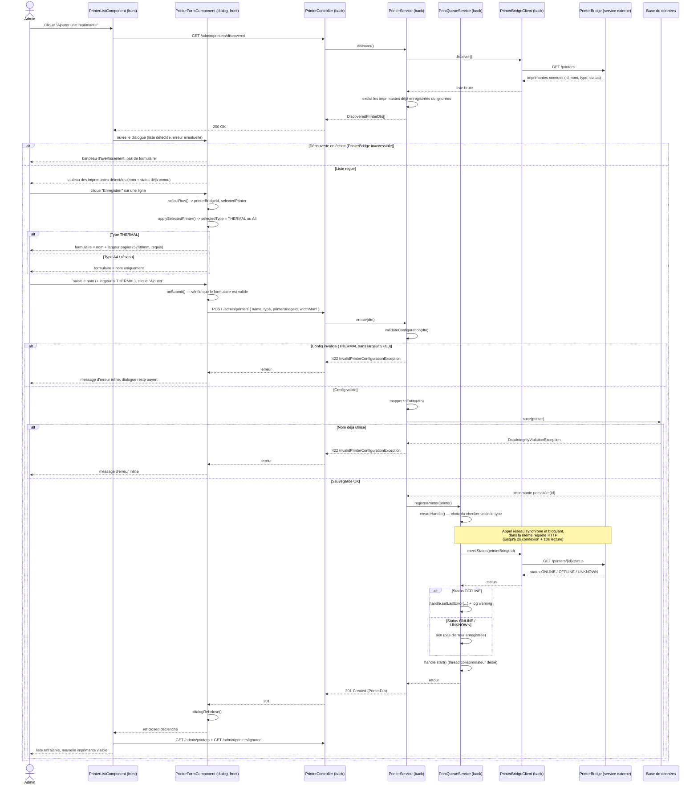

# Workflow — Ajout d'une imprimante (admin)

Ce document décrit le fonctionnement **actuel** du flux d'ajout d'une imprimante depuis la page d'administration, du clic sur "Ajouter une imprimante" jusqu'au clic final sur "Ajouter" dans le formulaire, pour les deux types d'imprimante (THERMAL et A4/réseau).

Sources : `printer-list.component.ts`, `printer-form.component.ts`, `PrinterController.java`, `PrinterService.java`, `PrintQueueService.java`, `PrinterBridgeClient.java`.

## Points clés du flux actuel

- **Un seul chemin de code pour THERMAL et A4** : la différence entre les deux types se limite au champ `widthMm` (affiché/requis seulement pour THERMAL) côté formulaire, et au choix du `PrinterConnectivityChecker` (`ThermalPrinterConnectivityChecker` vs `NetworkPrinterConnectivityChecker`) côté backend — les deux délèguent à `PrinterBridgeClient.checkStatus()`.
- **Le statut est récupéré deux fois** : une première fois lors de `discover()` (déjà présent dans `DiscoveredPrinterDto.status`, jamais transmis au `create()`), une seconde fois de façon bloquante lors de `registerPrinter()` au moment de l'enregistrement — c'est ce second appel qui pénalise le temps de réponse du clic final sur "Ajouter" (voir note dans le diagramme).
- **L'échec de la vérification de connectivité n'empêche pas la création** : si `checkStatus()` renvoie `OFFLINE` ou lève une exception applicative, l'imprimante est enregistrée quand même (seul `lastError` est renseigné sur le handle en mémoire) — seule une erreur de validation (422) ou un nom en doublon bloque réellement la création.
